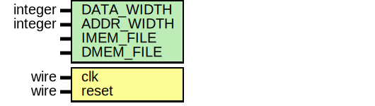

# Entity: cpu 
- **File**: cpu.v

## Diagram

## Schematic

## Generics

| Generic name | Type    | Value               | Description |
| ------------ | ------- | ------------------- | ----------- |
| DATA_WIDTH   | integer | 32                  | Datapath width in bits |
| ADDR_WIDTH   | integer | `ADDR_WIDTH        | Address bus width |
| IMEM_FILE    | string  | "src/instr_mem.mem" | Initial instruction memory contents |
| DMEM_FILE    | string  | "src/data_mem.mem"  | Initial data memory contents |

## Ports

| Port name | Direction | Type | Description |
| --------- | --------- | ---- | ----------- |
| clk       | input     | wire | System clock |
| reset     | input     | wire | Asynchronous reset |

## Signals

| Name      | Type        | Description |
| --------- | ----------- | ----------- |
| instr     | wire [31:0] | Fetched instruction |
| opcode    | wire [6:0]  | Decoded opcode |
| rd        | wire [4:0]  | Destination register index |
| rs1       | wire [4:0]  | Source register 1 index |
| rs2       | wire [4:0]  | Source register 2 index |
| funct3    | wire [2:0]  | Instruction `funct3` field |
| funct7    | wire [6:0]  | Instruction `funct7` field |
| csr       | wire [19:0] | CSR address field |
| alu_ctrl  | wire [3:0]  | ALU control code |
| imm_out   | wire [31:0] | Immediate value |
| reg_write | wire        | Register write enable |
| mem_read  | wire        | Data memory read enable |
| mem_write | wire        | Data memory write enable |
| alu_src   | wire        | Selects ALU operand B |
| op1_sel   | wire [1:0]  | Selects ALU operand A |
| wb_sel    | wire [1:0]  | Write-back source selector |
| is_branch | wire        | Branch instruction flag |
| is_jal    | wire        | JAL instruction flag |
| is_jalr   | wire        | JALR instruction flag |

## Instantiations

- u_controller: controller
- u_datapath: datapath

## Behavior
Top-level wrapper tying the controller and datapath together to form a simple RISC-V CPU.
