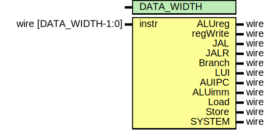

# Entity: decoder 
- **File**: decoder.v

## Diagram

## Generics

| Generic name | Type | Value | Description |
| ------------ | ---- | ----- | ----------- |
| DATA_WIDTH   |      | 32    |             |

## Ports

| Port name | Direction | Type                  | Description |
| --------- | --------- | --------------------- | ----------- |
| instr     | input     | wire [DATA_WIDTH-1:0] |             |
| ALUreg    | output    | wire                  |             |
| regWrite  | output    | wire                  |             |
| JAL       | output    | wire                  |             |
| JALR      | output    | wire                  |             |
| Branch    | output    | wire                  |             |
| LUI       | output    | wire                  |             |
| AUIPC     | output    | wire                  |             |
| ALUimm    | output    | wire                  |             |
| Load      | output    | wire                  |             |
| Store     | output    | wire                  |             |
| SYSTEM    | output    | wire                  |             |

## Signals

| Name                | Type       | Description |
| ------------------- | ---------- | ----------- |
| opcode = instr[6:0] | wire [6:0] |             |
