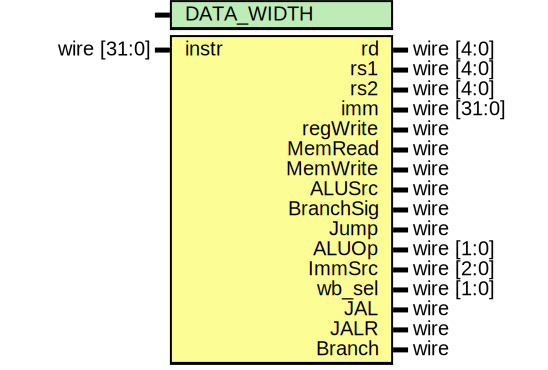

# Entity: decoder_glue 
- **File**: decoder_glue.v

## Diagram

## Generics

| Generic name | Type | Value | Description |
| ------------ | ---- | ----- | ----------- |
| DATA_WIDTH   |      | 32    |             |

## Ports

| Port name | Direction | Type        | Description |
| --------- | --------- | ----------- | ----------- |
| instr     | input     | wire [31:0] |             |
| rd        | output    | wire [4:0]  |             |
| rs1       | output    | wire [4:0]  |             |
| rs2       | output    | wire [4:0]  |             |
| imm       | output    | wire [31:0] |             |
| regWrite  | output    | wire        |             |
| MemRead   | output    | wire        |             |
| MemWrite  | output    | wire        |             |
| ALUSrc    | output    | wire        |             |
| BranchSig | output    | wire        |             |
| Jump      | output    | wire        |             |
| ALUOp     | output    | wire [1:0]  |             |
| ImmSrc    | output    | wire [2:0]  |             |
| wb_sel    | output    | wire [1:0]  |             |
| JAL       | output    | wire        |             |
| JALR      | output    | wire        |             |
| Branch    | output    | wire        |             |

## Signals

| Name     | Type | Description |
| -------- | ---- | ----------- |
| ALUreg   | wire |             |
| ALUimm   | wire |             |
| LUI      | wire |             |
| AUIPC    | wire |             |
| Load     | wire |             |
| Store    | wire |             |
| SYSTEM   | wire |             |
| MemtoReg | wire |             |

## Instantiations

- u_dec: decoder
- u_ctl: control
- u_imm: imm_gen
