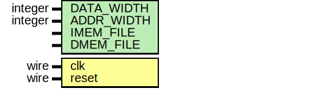
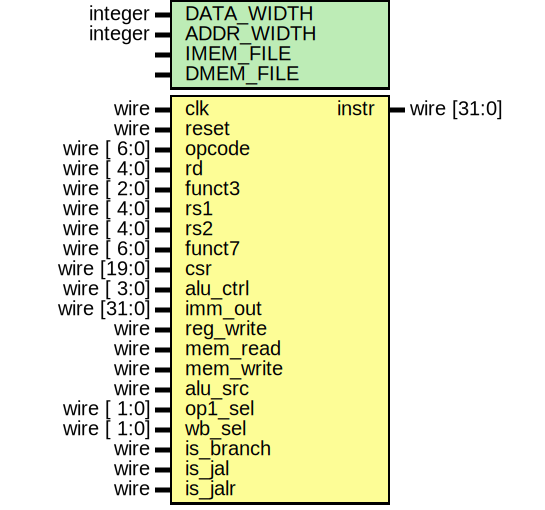

# Project Overview

- 32-bit RV32I single-cycle CPU core
- Show architecture with controller and datapath blocks



---

# Agenda

1. Project context
2. Repository layout
3. Build & test commands
4. Vivado simulation demo
5. Controller & datapath tour
6. Handover checklist
7. Recording tips
8. Wrap-Up

---

# Project Context

- Goal: teaching-oriented single-cycle CPU
- Toolchain: Icarus/GTKWave or Vivado xsim
- Include a screenshot of README intro


---

# Repository Layout

- `src/` : RTL modules
- `tb/` : testbenches
- `docs/` : module docs and schematics
- `Makefile` : build/sim automation
- Snapshot to capture: VS Code tree


---

# Build & Test

```bash
make           # run all Icarus tests
make schem     # regenerate SVG schematics
```

- Include terminal screenshot of successful `make`


---

# Vivado Simulation

```bash
make vivado comp=cpu      # elaborate
xsim work.cpu_tb          # run
```

- Demonstrate waveform with:
  - Program counter
  - Register file writes
  - Memory bus
- Snapshot to include: xsim waveform


---

# Controller FSM

- Finite-state machine drives control signals
- Show fetch → decode → execute → mem → writeback


---

# Datapath

- ALU, register file, memory, multiplexers
- Highlight control signal paths



---

# Handover Checklist

- All tests pass
- Schematics regenerated
- TODOs noted in `docs/handover.md`
- Record demo video and store script

---

# Recording Tips

1. Start with slides, then VS Code, then Vivado
2. Pre-arrange waveforms and code windows
3. Keep narration < 10 minutes
- Optional snapshot: OBS layout


---

# Wrap-Up

- Review accomplishments & next steps
- Point to repository for details
- Thanks!