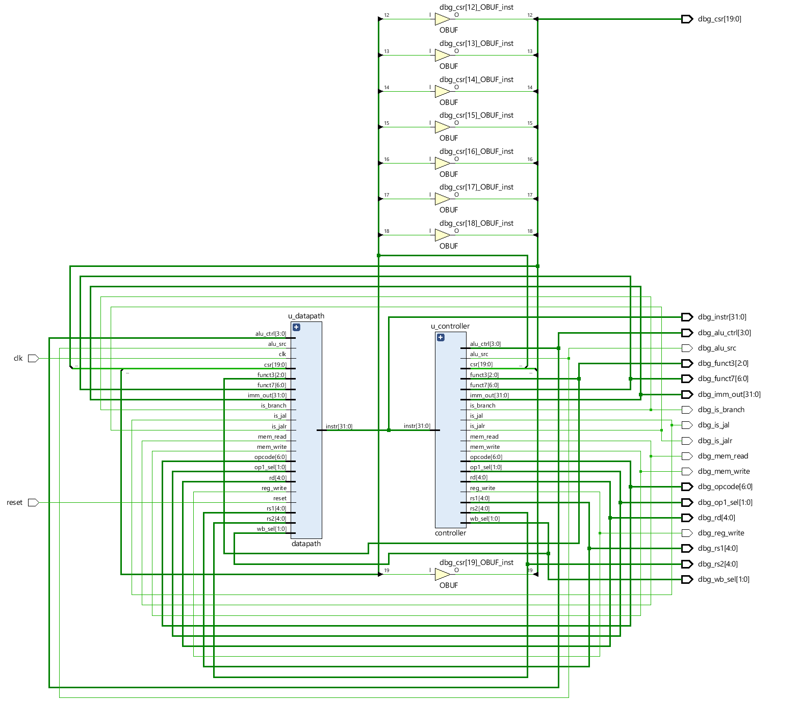
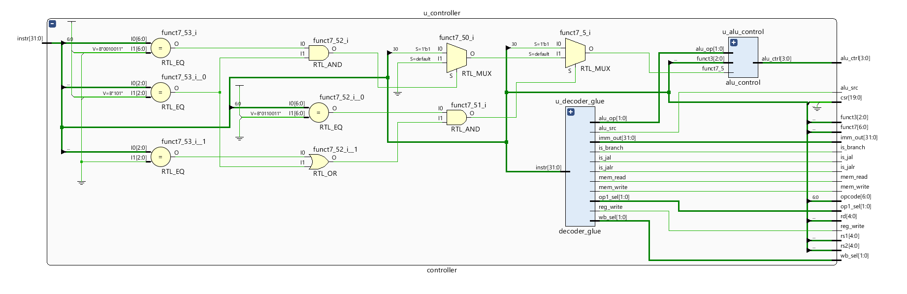

# Project Overview
- Modular, single‑cycle RV32I CPU core in Verilog
- Reusable blocks, automated Makefile flow, testbenches
- Goals: educational clarity and extensibility

---

# Objectives
| Objective                | Details                                                  |
| ------------------------ | -------------------------------------------------------- |
| Implement RV32I subset   | ALU, control, memory, branch & jump support              |
| Deliver reusable modules | Instruction decode, execution, memory access, write‑back |
| Automate workflow        | `make` targets for lint, simulation, schematics, Vivado  |

---

# Tools & Environment
| Tool / Component   | Purpose                         |
| ------------------ | ------------------------------- |
| Icarus Verilog     | Simulation                      |
| GTKWave            | Waveform inspection             |
| Vivado XSIM        | Alternate sim & synthesis       |
| yosys + netlistsvg | Schematic generation            |
| Makefile           | Unified build & test automation |
| GitHub             | Version control & collaboration |

---

# Methodology
- Verilog‑2001, consistent `snake_case` naming
- Feature branches, frequent commits
- Directory separation: headers, RTL, glue, testbenches, docs
- `make` orchestrates lint → sim → schematics → Vivado flow

---

# Simulation & Validation
| Program          | Coverage Purpose  |
| ---------------- | ----------------- |
| `add`            | ALU arithmetic    |
| `store` / `load` | Memory interface  |
| `jump`           | PC control        |
| `branches`       | Branch comparator |

Outputs cross‑checked with RARS/QEMU.

---

# Instruction Coverage
| Category                       | Instructions                                         |
| ------------------------------ | ---------------------------------------------------- |
| Arithmetic & logic (reg)       | add, sub, and, or, xor, sll, srl, sra, slt, sltu     |
| Arithmetic & logic (imm)       | addi, xori, ori, andi, slli, srli, srai, slti, sltiu |
| Memory access                  | lw, sw                                               |
| Branches                       | beq, bne, blt, bltu, bge, bgeu                       |
| Jumps                          | jal, jalr                                            |
| Upper immediates & PC-relative | lui, auipc                                           |

---

# Architecture Snapshot
- Controller decodes and generates control signals
- Datapath executes via register file, ALU, memories
- Branch comparator & PC logic manage flow control

---

# Core Modules
| Module         | Responsibility                                                  |
| -------------- | --------------------------------------------------------------- |
| **controller** | Instruction decode, control signal generation, ALU op selection |
| **datapath**   | Coordinates register file, ALU, memories, PC & branch logic     |
| **cpu**        | Top-level wrapper with debug probes and parameterization        |

---
# Controller

---
# Datapath

---
# Supporting Modules
| Module                  | Purpose / Notes                                            |
| ----------------------- | ---------------------------------------------------------- |
| `alu`, `alu_control`    | Arithmetic & logic execution                               |
| `branch_comp`           | Evaluates branch conditions                                |
| `regfile`               | 32×32 register file, x0 guard                              |
| `instr_mem`, `data_mem` | Program/data storage, `$readmemh` initialization           |
| `next_pc`               | Branch/jump target selection                               |
| `imm_gen`               | Immediate extraction (I/S/B/U/J)                           |
| `mux2`, `mux4`          | Parameterized multiplexers                                 |
| `pc`                    | Program counter register                                   |
| `instr_slicer`          | Field extraction utility                                   |
| `wb_mux`                | Write-back selection (standalone, not in current datapath) |
---
# Testing

|Program | Tested Instructions | Pass |
| ----------|-----------| -------|
| prog.mem | load, store, jal | all passed |
| branches.mem | beq, bne, ... | |

---

# Key Results
| Metric 	| Value 	| Source |
| ----------|-----------| -------|
| Slice LUTs 	| 2,439 	| logs/utilization.rpt |
| Slice Registers 	| 1,056 	| logs/utilization.rpt |
| Max clock frequency 	| Not reported (no timing constraints) 	| logs/timing_summary.rpt |
| Total on-chip power 	| 3.618 W (dynamic 3.453 W, static 0.165 W) 	| logs/power.rpt |

---

# Challenges & Mitigations
| Challenge                               | Mitigation                                      |
| --------------------------------------- | ----------------------------------------------- |
| Branch comparator waveform misalignment | Insert delay/register before reassigning inputs |
| Limited RV32I subset                    | Plan incremental ISA expansion                  |
| Resource overhead                       | Accept trade-off for teaching clarity           |

---

# Future Work
- Extend ISA: RV32M, CSR, pipeline stages
- Integrate `wb_mux` and kill gating
- Broaden test coverage & automation
- Connect CSR/system ports for privileged ISA
- Benchmark against additional reference cores

---

# References
1. *RISC-V ISA Specification, Volume I*
2. *Icarus Verilog* & *GTKWave* documentation
3. *Xilinx Vivado Design Suite* user guides
4. *yosys* & *netlistsvg* documentation
5. Patterson & Hennessy, *Computer Organization and Design RISC‑V Edition*

---

# Contact & Handover
- Repository contains detailed module docs, schematics, and waveforms
- Reach out to project maintainers for onboarding or further guidance
- Thank you!
