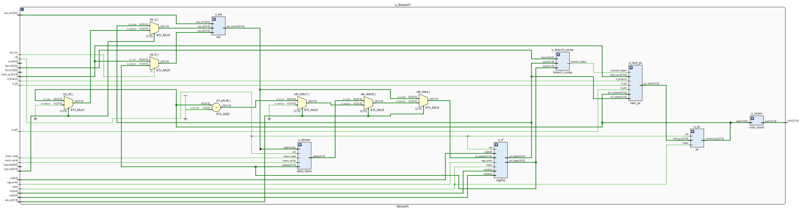

---

title: "RISCV32I Single Cycle Core - Design, Simulation and Synthesis"
author: "Khongorzul TURKHUU"
date: "2025‑08‑25"
------------------

# Project Overview

* Modular, single‑cycle RV32I CPU core in Verilog
* Reusable blocks, automated Makefile flow, testbenches
* Goals: clarity for learning and easy extensibility

---

# Objectives

| Objective                | Details                                          |
| ------------------------ | ------------------------------------------------ |
| Implement RV32I subset   | ALU, control, memory, branch & jump support      |
| Deliver reusable modules | Decode, execute, memory access, write‑back       |
| Automate workflow        | `make` targets for lint, sim, schematics, Vivado |

---
# Simulation & Validation

| Program          | Focus             |
| ---------------- | ----------------- |
| `add`            | ALU arithmetic    |
| `store` / `load` | Memory interface  |
| `jump`           | PC control        |
| `branches`       | Branch comparator |

Cross‑checked with RARS/QEMU.

---
# Waveform

1. First instruction (0x01000313)

instr=01000313 → ADDI x6, x0, 16 (rd=6, rs1=0, imm=0x10).

imm_out=0x10, rd=06, rs1=00, alu_ctrl=0 (ADD).

debug_alu=0x10, which matches rs1(0)+imm(16).

reg_write=1 asserts, meaning result goes into x6.

2. Second instruction (0xDEADC3B7)

LUI x7, 0xDEADC.

instr=DEADC3B7, rd=07, imm_out=DEADC000.

debug_alu=DEADC000 (upper 20 bits loaded, lower 12 cleared).

reg_write=1.
✅ Matches LUI semantics.

---

# Waveform

3. Third instruction (0xEEF38393)

ADDI x7, x7, -273 (0xEEF).

rs1=07, rd=07, imm_out=0xFFFFFEEF.

debug_alu=DEADC000 + FFFFFEEF = DEADC0?? (shown as DEADC0??).

Value matches expectation.
✅ Execution aligns with RISC-V behavior.

4. Fourth instruction (0x04702023)

SW x7, 72(x0).

mem_write=1, rs2=07 as store source, base=0, imm=0x48.

Correct store control signals set.
✅ Control signals consistent.

5. Fifth instruction (0x0000006F)

JAL x0, 0.

PC changes, wb_sel=01 and op1_sel update for jump.

reg_write=0 (since rd=x0).
✅ Correct jump control.

---
# Instruction Coverage

| Category                       | Instructions                                         |
| ------------------------------ | ---------------------------------------------------- |
| Arithmetic & logic (reg)       | add, sub, and, or, xor, sll, srl, sra, slt, sltu     |
| Arithmetic & logic (imm)       | addi, xori, ori, andi, slli, srli, srai, slti, sltiu |
| Memory access                  | lw, sw                                               |
| Branches                       | beq, bne, blt, bltu, bge, bgeu                       |
| Jumps                          | jal, jalr                                            |
| Upper immediates & PC-relative | lui, auipc                                           |

---

# Architecture Snapshot

* Controller decodes and generates signals
* Datapath executes via regfile, ALU, memories
* Branch comparator & PC logic drive control flow

---

# Core Modules

| Module         | Responsibility                             |
| -------------- | ------------------------------------------ |
| **controller** | Decode, generate control, ALU op selection |
| **datapath**   | Regfile, ALU, memories, PC & branch logic  |
| **cpu**        | Top-level wrapper with debug probes        |

---

# Controller

* Slices fields from instruction (opcode, funct3, funct7, rs/rd)
* Delegates to **decoder\_glue**:

  * *decoder*: classify instr, set reg\_write
  * *control*: map to datapath signals (mem, alu\_src, wb\_sel)
  * *imm\_gen*: sign-extend immediates (I/S/B/U/J)
* Feeds alu\_op, funct3, funct7\_5 into **alu\_control**
* Emits all signals for datapath

---

# Datapath

* Executes full instruction cycle
* **Control flow**: branch\_comp + next\_pc + pc register
* **Regfile**: 32×32, sync write, comb read
* **Operand select**: rs1/PC/zero and rs2/imm
* **ALU**: arithmetic/logic ops, result → mem or wb
* **Memory**: word-addressed instr/data mem, sync writes
* **Write-back**: mux between ALU result, memory, pc+4

---

# Supporting Modules

| Module                  | Purpose                                  |
| ----------------------- | ---------------------------------------- |
| `alu`, `alu_control`    | Arithmetic & logic execution             |
| `branch_comp`           | Branch evaluation                        |
| `regfile`               | 32×32 register file, x0 guard            |
| `instr_mem`, `data_mem` | Program/data storage, `$readmemh` init   |
| `next_pc`               | PC update logic                          |
| `imm_gen`               | Immediate extraction                     |
| `mux2`, `mux4`          | Multiplexers                             |
| `pc`                    | Program counter register                 |
| `instr_slicer`          | Utility for instruction fields           |
| `wb_mux`                | Write-back mux (not in current datapath) |

---

# CPU Validation

| Program       | Tested Instructions                                  | Pass |
| ------------- | ---------------------------------------------------- | ---- |
| prog.mem      | load, store, jal                                     | yes  |
| branches.mem  | beq, bne, blt, bltu, bge, bgeu                       | yes  |
| r\_alu.mem    | add, sub, and, or, xor, sll, srl, sra, slt, sltu     | yes  |
| i\_alu.mem    | addi, xori, ori, andi, slli, srli, srai, slti, sltiu | yes  |
| mem\_rw\.mem  | lui, sw, lw, add                                     | yes  |
| jumps.mem     | auipc, jal, jalr                                     | yes  |
| x0\_guard.mem | addi(x0), sub(x0), beq                               | yes  |

---

# RTL Testing

| Module        | Scope                        | Tests |
| ------------- | ---------------------------- | ----- |
| adder         | Overflow, negatives          | 4     |
| alu\_control  | ALUOp decoding               | 22    |
| alu           | ADD, SUB, logic, shifts, cmp | 11    |
| branch\_comp  | BEQ/BNE/BLT/BGE/BLTU/BGEU    | 13    |
| controller    | Flow checks                  | 65    |
| control       | R/I ops, mem, branch, jumps  | 17    |
| cpu           | Small program                | 2     |
| data\_mem     | Init read                    | 1     |
| datapath      | ALU, mem, branch, jumps      | 17    |
| decoder\_glue | Glue interface               | N/A   |
| decoder       | R/I/S/B/U/J decode           | 9     |
| imm\_gen      | Immediate formats            | 11    |
| instr\_mem    | Program read                 | 3     |
| instr\_slicer | Field slices + random tests  | 210   |
| next\_pc      | PC updates                   | 7     |
| pc            | Reset, increment, jump       | 4     |
| regfile       | Reset, writes, x0 check      | 154   |
| wb\_mux       | ALU/MEM/PC+4 paths           | 8     |

---

# Key Results

| Metric              | Value                             | Source              |
| ------------------- | --------------------------------- | ------------------- |
| Slice LUTs          | 2,439                             | utilization.rpt     |
| Slice Registers     | 1,056                             | utilization.rpt     |
| Max clock frequency | N/A (no timing constraints)       | timing\_summary.rpt |
| On-chip power       | 3.618 W (dyn 3.453, static 0.165) | power.rpt           |

---

# Challenges & Mitigations

| Challenge                | Mitigation                       |
| ------------------------ | -------------------------------- |
| Branch waveform misalign | Added delay/register             |
| Limited RV32I subset     | Plan incremental expansion       |
| Higher LUT use           | Accepted for clarity in teaching |

---

# Future Work

* Extend ISA: RV32M, CSR, pipelining
* Broaden automated test coverage
* Add privileged ISA support
* Benchmark against other cores

---

# References

1. *RISC-V ISA Specification, Volume I*
2. *Icarus Verilog* & *GTKWave* docs
3. *Xilinx Vivado* user guides
4. *yosys* & *netlistsvg* docs
5. Patterson & Hennessy, *Computer Organization and Design RISC‑V Edition*

---

# Contact & Handover

* Repository: docs, schematics, waveforms included
* Contact maintainers for onboarding
* End of handover
