# RISC-V CPU Design and Simulation – Internship Report

## Acknowledgments
I extend my heartfelt thanks to my supervisors and mentors for their guidance and encouragement throughout this internship.
I am equally grateful to the host organization for providing the resources and supportive environment that made this work possible.
Additional appreciation goes to colleagues, collaborators, and the institutions that offered technical assistance and shared tools that contributed to the success of this project.

## Abstract
This report documents the design and simulation of a modular, single-cycle RISC-V CPU core. It outlines project objectives, tools and environment, methodology, verification strategies, and key results achieved.

## Table of Contents

1. Introduction ............................................. 1
2. Objectives ............................................... 1
3. Tools & Environment ...................................... 2
4. Methodology .............................................. 2
5. Simulation & Debug Process ............................... 2
6. Validation ............................................... 2
7. Comparison & Benchmarking ............................... 3
8. Limitations .............................................. 3
9. Learning Outcomes ........................................ 3
10. Personal Reflections .................................... 4
11. Reflection (Internship Specific) ........................ 4
12. System Architecture ..................................... 4
13. Implementation Highlights .............................. 5
14. Testing & Verification ................................. 5
15. Challenges & Mitigations ............................... 6
16. Results ................................................ 6
17. Future Work ............................................ 6
18. Conclusion ............................................. 6
19. Appendices ............................................. 6
20. Vivado Reports ......................................... 7
21. Appendix: Module Overview .............................. 7
22. References ............................................ 14

## 1. Introduction
This project implements a modular, single-cycle RISC-V CPU core written in Verilog. The repository includes reusable building blocks, control logic, a streamlined Makefile-driven flow, and testbenches for simulation.

> **Figure 1:** _Overall CPU Block Diagram_
> 

### Role and Contributions

As a hardware design intern on the Simple CPU project:

- **Daily tasks**: implementing Verilog modules, writing testbenches, running simulations, reviewing waveforms, and refining the Makefile workflow.
- **Key contributions**: developed the ALU and branch comparator blocks, integrated schematic generation into the build flow, and improved testbench coverage.

## 2. Objectives
- Develop a fully functional single-cycle CPU that executes a subset of the RISC-V ISA.
- Provide self-contained Verilog modules for instruction decoding, control, execution, memory access, and write-back.
- Automate linting, simulation, waveform generation, and schematic rendering using a unified `make` workflow that includes both Icarus Verilog and Vivado flows.

## 3. Tools & Environment  
- **Icarus Verilog** for compilation and simulation.  
- **GTKWave** for waveform inspection.  
- **Vivado XSIM** and schematic tools (`yosys`, `jq`, `netlistsvg`) integrated into the default Make targets—these are mandatory components of the build flow.  
- The Makefile workflow lints, builds, runs, and opens waveforms for all `tb/*_tb.v` testbenches, ensuring both Icarus and Vivado simulations are run by default.  
- Project layout separates headers, leaf RTL, glue logic, top wrappers, testbenches, and generated artifacts.

> **Figure 2:** _Vivado Flow Diagram_
> 

## 4. Methodology

- **Version Control**  
  Development tracked via GitHub with feature branches and frequent commits.

- **Coding Guidelines**  
  Verilog‑2001 syntax only, with consistent `snake_case` naming for modules and signals.

- **Automation**  
  Makefile targets run lint, simulation, schematics, and Vivado tasks in one flow.

- **File Structure**  
  Headers, leaf RTL, glue modules, testbenches, and generated outputs are kept in distinct directories.

## 5. Simulation & Debug Process

Typical workflow when issues surfaced began by recreating the failure with `make` to run both Icarus and Vivado simulations, then inspecting waveforms in GTKWave or XSIM to compare expected versus observed behavior. Iterative passes then:

- created and tested glue modules,
- handled design-choice incompatibilities,
- refactored leaf modules for consistency, and
- rewrote testbenches after refactors.

Waveform snapshots (expected vs. observed) were annotated to document each fix, and the cycle repeated from leaf modules to the integrated datapath and finally the full CPU.

## 6. Validation

- Programs tested: `add`, `store`, `load`, `jump`.
- Output cross‑checked with RARS or QEMU to confirm correctness.
- Coverage limited to the implemented RV32I subset.

## 7. Comparison & Benchmarking

Compared the design with PicoRV32:

- **Instruction coverage**: partial RV32I vs. PicoRV32’s broader set. The core supports the following instructions:

  | Category | Instructions |
  | --- | --- |
  | Arithmetic & logic (register) | add, sub, and, or, xor, sll, srl, sra, slt, sltu |
  | Arithmetic & logic (immediate) | addi, xori, ori, andi, slli, srli, srai, slti, sltiu |
  | Memory access | lw, sw |
  | Branches | beq, bne, blt, bltu, bge, bgeu |
  | Jumps | jal, jalr |
  | Upper immediates & PC-relative | lui, auipc |

  CSR/system ports are provisioned but remain unconnected; they are intended for future integration when the core expands to the privileged ISA and a pipelined architecture.
- **Resource usage**: higher LUT/FF count due to single-cycle simplicity.
- **Latency**: single cycle per instruction vs. PicoRV32’s multi-cycle approach.

Key Vivado metrics for the synthesized core:

| Metric | Value | Source |
| --- | --- | --- |
| Slice LUTs | 2,439 | `logs/utilization.rpt` |
| Slice Registers | 1,056 | `logs/utilization.rpt` |
| Max clock frequency | Not reported (no timing constraints) | `logs/timing_summary.rpt` |
| Total on-chip power | 3.618 W (dynamic 3.453 W, static 0.165 W) | `logs/power.rpt` |

## 8. Limitations

- Single-cycle architecture constrains maximum clock frequency.
- No CSR or system instruction support.
- Synthesis reports flag unconstrained clocks and many unconstrained endpoints.

## 9. Learning Outcomes

- Mastered Vivado TCL scripting and Makefile automation. Early scripts created wiring mismatches when module ports were ordered incorrectly, but refining the TCL flow to auto-derive connections resolved the issue.
- Gained experience in modular RTL design and waveform‑based debugging. A misuse of `funct7_5` led to incorrect shift operations; tracing the waveform exposed the bug and adjusting the decoder fixed it.
- Developed a deeper understanding of datapath/control separation. Consolidating ALU functionality blurred control boundaries at first, yet reorganizing the case structure restored clarity and decoupled the units.

## 10. Personal Reflections

The internship accelerated my confidence in hardware design. Translating textbook knowledge into working modules and iterating through real tool flows taught me to reason about both logic and process, turning tentative skills into a dependable workflow.

The aspects I enjoyed most were the automation and cross-tool experimentation. Watching a single `make` invoke lint, synthesis, simulation, and waveform visualization made each change immediately tangible and kept motivation high as the CPU gradually came to life.

Some challenges linger, particularly around deep timing analysis and hardware validation. I still grapple with interpreting extensive Vivado reports and wish I had more board time to observe how the design behaves under real constraints.

## 11. Reflection (Internship Specific)

- **Challenges**: integrating disparate toolchains, resolving simulation mismatches.
- **Skills gained**: FPGA flow familiarity, collaborative version control.
- **Future application**: solid foundation for FYP and potential FPGA/ASIC roles.

## 12. System Architecture

| Layer | Description |
|-------|-------------|
| **Top-Level CPU** | Integrates the controller and datapath, wiring instruction fields, control signals, and memory interfaces |
| **Controller** | Extracts opcode, registers, and immediates, delegating to `decoder_glue` and `alu_control` |
| **decoder_glue** | Combines `decoder`, `control`, and `imm_gen` outputs into unified control signals |
| **Datapath** | Coordinates instruction fetch, register file access, ALU operations, branch logic, memory access, and write-back selection |
| **Next PC Unit** | Chooses sequential PC or branch/jump targets, aligning JALR addresses and verifying alignment |
| **Leaf Modules** | ALU supports arithmetic, logical, and shift operations with zero detection; branch comparator evaluates conditional jumps |

The controller passes decoded instruction fields to `decoder_glue`, which fuses control and immediate data before signaling the leaf modules.

> **Figure 3:** _CPU Top-Level_
> 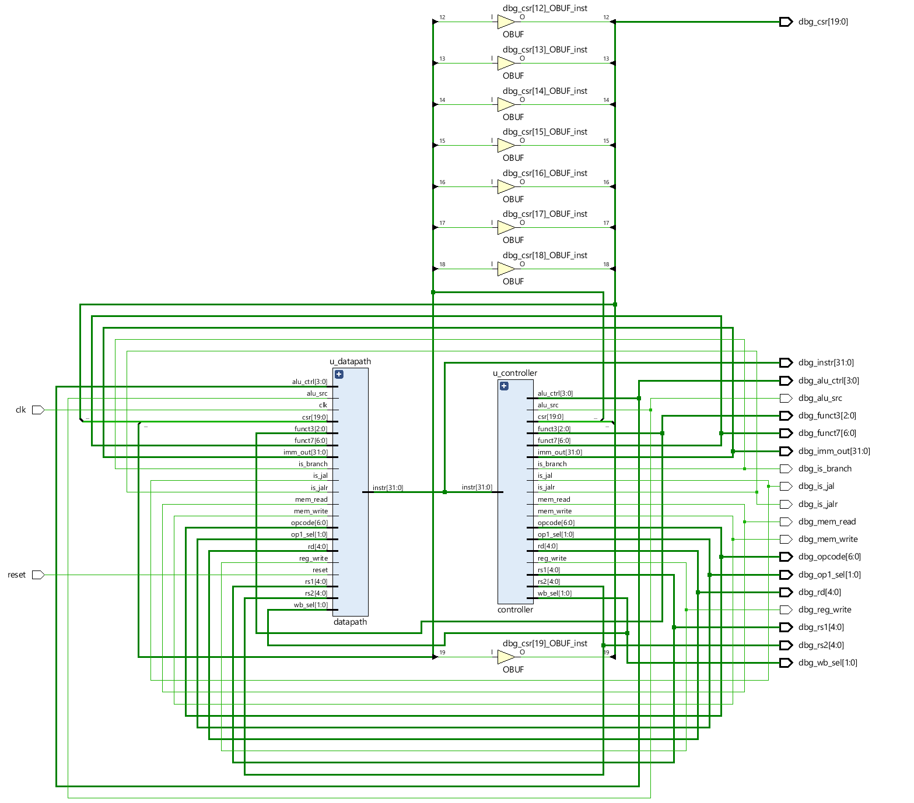

> **Figure 4:** _Controller_
> 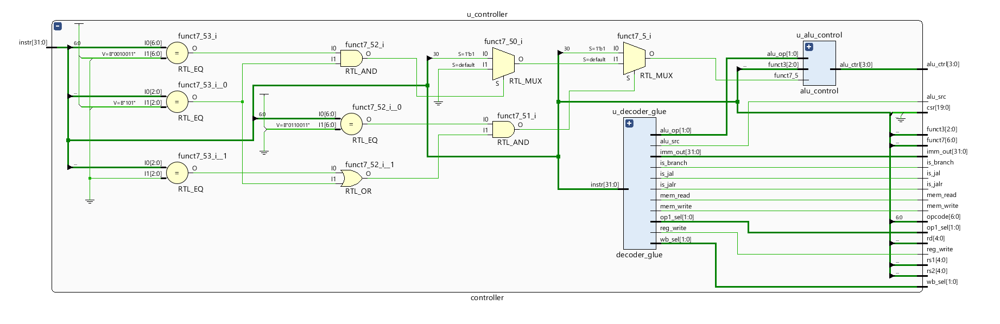

> **Figure 5:** _Decoder Glue_
> 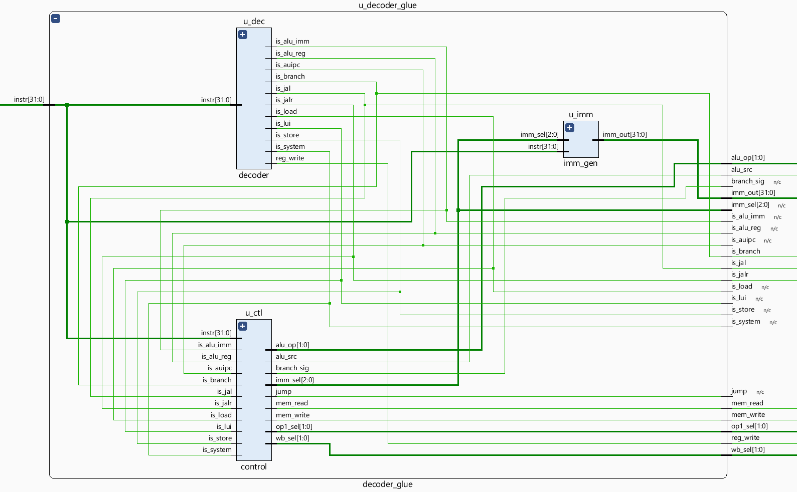

> **Figure 6:** _Datapath_
> 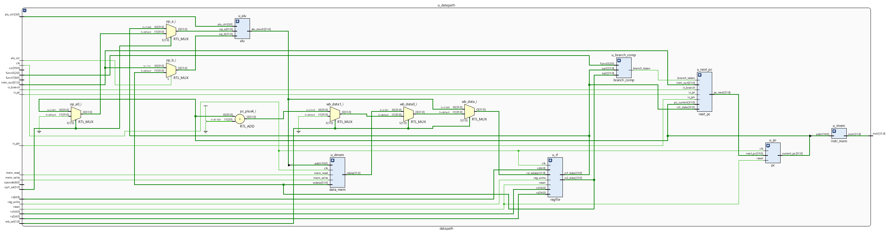

> **Figure 7:** _Next PC Unit_
> 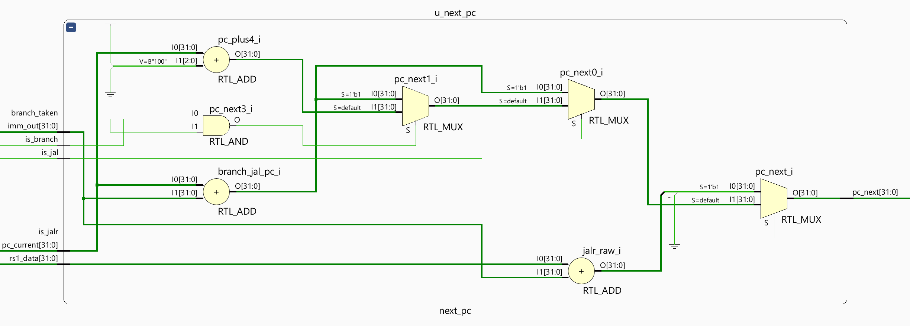

A complete inventory of modules and their interfaces is documented for quick reference.

## 13. Implementation Highlights
- Parameterizable data and address widths allow experimentation with different memory sizes.  
- Immediate generation, control, and execution paths remain decoupled for clarity and reuse.  
- Memory files (`src/instr_mem.mem`, `src/data_mem.mem`) enable preloaded programs and data.  

## 14. Testing & Verification
- Each module has an associated testbench (`tb/<module>_tb.v`), automatically discovered by the Makefile.  
- Running `make` performs lint, build, simulation, waveform dumping, **and Vivado simulation** for all testbenches.
- Schematic rendering (`make schem`) visualizes module structure, aiding design reviews.

Recent Vivado reports provide a snapshot of the current design health. A DRC warning indicates the PS7 block is required for the target device. Timing analysis notes 2,080 register/latch pins without clocks, 11,328 unconstrained internal endpoints, and missing delay specifications on one input and 35 outputs. Power is estimated at 3.618 W (3.453 W dynamic and 0.165 W static), and resource utilization reaches 2,439 slice LUTs (13.86 %) and 1,056 registers (3.00 %). No formal coverage metrics are captured; testing remains limited to the RV32I subset exercised by existing programs. See the appendices or `logs/` folder for full report details.


### Simulation Testing
Testing was performed on a local workstation using Icarus Verilog, with
spot checks run in Vivado's XSIM to ensure compatibility with the AMD
toolflow. Module-level testbenches executed successfully and waveforms
were reviewed for key components. Hardware FPGA runs were not possible
due to limited board access and internship time, so full-system
integration tests remain outstanding.

### Testing and ISA Coverage

| Module | Tests (what instructions) | Expected behavior | Total number of tests |
| --- | --- | --- | --- |
| adder | Basic additions incl. overflow and negative operands | Sum equals arithmetic result | 4 |
| alu_control | ALUOp decoding for R-type, I-type, shift, logical, LUI, ADDI/ANDI/ORI/XORI/SLTI/SLTIU/SLLI/SRLI/SRAI | Generates correct ALU control codes | 22 |
| alu | ADD, SUB, logical (AND/OR/XOR), shifts, comparisons, zero flag | Outputs correct value and flags for each operation | 11 |
| branch_comp | BEQ/BNE/BLT/BGE/BLTU/BGEU and default case | Branch-taken signal matches comparison | 13 |
| controller | State-machine checks across instruction flow | All controller checks pass | 65 |
| control | R-type, ADDI, ANDI, ORI, XORI, SLTI, SLTIU, SLLI, SRLI, SRAI, LW, SW, BEQ, JAL, JALR, LUI, AUIPC | Correct control signals for each instruction | 17 |
| cpu | Small program using ADDI, store, END sentinel | Registers and memory reflect program semantics | 2 |
| data_mem | Read from initialized memory word | Returned data equals `deadbeef` | 1 |
| datapath | ALU ops, store/load, immediate ops, shifts, branches, jumps | Pipeline updates registers/memory/PC correctly | 17 |
| decoder_glue | Glue logic interface scenarios | All glue assertions satisfied | N/A (not reported) |
| decoder | add, addi, lw, sw, beq, jalr, jal, lui, auipc | Fields decoded correctly | 9 |
| imm_gen | Immediate extraction for I/S/B/U/J formats and bounds | Correct signed/unsigned immediates | 11 |
| instr_mem | Reads at addresses 0–2 | Returned words match expected program | 3 |
| instr_slicer | R/I/S/B/U/J/CSR patterns + 200 random instructions | Field slices match encoding (~1682 assertions) | 210 cases |
| next_pc | pc+4, branch taken/not, JAL, JALR, priority cases | PC updates to correct next address | 7 |
| pc | Reset, two sequential +4 steps, branch to 0xA0 | PC reflects reset/increment/jump | 4 |
| regfile | Reset, sequential writes, back-to-back writes, randomized accesses, re-reset | Reads match writes, x0 constant | 154 |
| wb_mux | ALU, MEM, PC+4 paths; kill gating; x0/x31 writes | Selected data routed; gating works | 8 |

> **Limitation:** Load and store support is restricted to word-aligned operations. Byte and half-word accesses, along with any sign-extension logic, are not implemented.

### Testing Notes
Results reflect these simulation-only tests; hardware performance and
long-duration behavior still need evaluation.

> **Figure 8:** _Waveform Example_
> 

## 15. Challenges & Mitigations
- **Instruction-alignment checks** in `next_pc` identify misaligned addresses during simulation, preventing silent control-flow errors.  
- **Branch diversity** is handled by a dedicated comparator module, simplifying decoder logic and ensuring extensibility.

## 16. Results
The repository provides a complete, simulation-ready RISC-V core with comprehensive testbenches and an extensible build system. The modular design facilitates future enhancements, experimentation, and instructional use.

## 17. Future Work
- Introduce pipelining to improve throughput.  
- Add hazard detection and forwarding.  
- Expand instruction coverage (e.g., system instructions, multiplication/division).  
- Integrate a cache or memory hierarchy for realistic performance evaluation.

## 18. Conclusion
This project delivers a clean, modular foundation for RISC-V CPU exploration. The codebase’s structure, documentation, and automated tooling—now including mandatory Vivado flows—make it suitable for both educational purposes and further research or development. However, load/store capability is limited to word-aligned operations; byte and half-word accesses with sign-extension are not yet supported, so the core should be regarded as a partial RV32I implementation.

## 19. Appendices

- **Instruction Subset Table**: list supported RV32I instructions.
- **Sample Testbench**: e.g., `alu_tb` with brief explanation.
- **Waveform Screenshots**: key modules and CPU integration.
- **Vivado Reports**: synthesis, utilization, timing summaries.
- **Repository Tree**: top-level project structure for quick orientation.

## 20. Vivado Reports
The `logs/` directory contains Vivado-generated synthesis, timing, power, and rule-check reports for the `cpu` design. Key highlights include:

- Clock reports show the top-level `clk` is unconstrained, leaving 2,080 endpoints without timing analysis.
- A design rule check warns about a missing PS7 block (`ZPS7-1`).
- Methodology analysis flags 1,000 non-clocked sequential cells and extensive use of distributed RAM.
- Power analysis estimates total on-chip power of 3.618 W with the program counter consuming the largest share.
- Timing summary lists thousands of unconstrained internal endpoints and undefined I/O delays.
- Utilization reports 2,439 slice LUTs and 1,056 slice registers in use.

These reports guide next steps such as adding clock constraints, resolving DRC warnings, and optimizing resource usage.

### Testing
Testing was performed on a local workstation using Icarus Verilog, with
spot checks run in Vivado's XSIM to ensure compatibility with the AMD
toolflow. Module-level testbenches executed successfully and waveforms
were reviewed for key components. Hardware FPGA runs were not possible
due to limited board access and internship time, so full-system
integration tests remain outstanding.

### Notes
Results reflect these simulation-only tests; hardware performance and
long-duration behavior still need evaluation.


## 21. Appendix: Module Overview

### Repository Tree

```text
src/
tb/
logs/
docs/
images/
include/
scripts/
tests/
vivado_proj/
waves/
```

### Core Modules

#### cpu
**Purpose.** Top-level wrapper that wires together controller and datapath and exposes debug probes.

**Key ports.**
- Inputs: `clk`, `reset`
- Debug outputs: `debug_pc`, `debug_instr`, `debug_alu`
- Parameters: data/addr widths and optional instruction/data memory file paths

**Behavior.** Passes the instruction to the controller, routes control signals/decoded fields/immediate to the datapath, and taps PC/instruction/ALU result for observability. No extra logic beyond wiring and parameter passing.


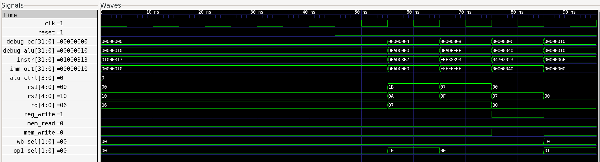

**Waveform explanation:** The CPU test loads `tests/prog.mem`, releases reset, and runs until a `jal x0,0` sentinel. The waveform shows x6 receiving `0x10` from an ADDI, x7 being loaded and adjusted, a store of `0xDEADBEEF` to address `0x40`, and finally the self‑looping JAL that halts the program.

#### controller
**Purpose.** Decode the incoming instruction into datapath controls and an ALU operation code.

**Inputs.** `instr[31:0]`

**Outputs.**
- Register decode fields: `opcode`, `rd`, `funct3`, `rs1`, `rs2`, `funct7`, `csr`
- Controls: `reg_write`, `mem_read`, `mem_write`, `alu_src`, `op1_sel[1:0]`, `wb_sel[1:0]`
- ALU: `alu_ctrl[3:0]`
- Flow hints: `is_branch`, `is_jal`, `is_jalr`
- Immediate: `imm_out[31:0]`

**Implementation notes.**
- Performs field slicing directly—no external `instr_slicer` is instantiated.
- Internally instantiates `decoder_glue` (which itself includes `decoder`, `control`, and `imm_gen`) and then `alu_control`.
- There is no `op2_sel`; the second ALU operand is chosen solely via the single‑bit `alu_src`.

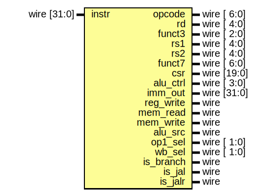

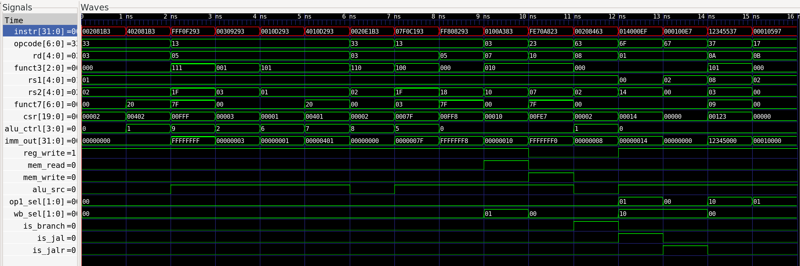

**Waveform explanation:** `controller_tb` drives full instructions through the top‑level controller, which slices fields, generates immediates, and sets control signals. The waveform demonstrates proper field decoding, ALU control selection, register write enables, and memory signals for representative instructions.

#### datapath
**Purpose.** Execute the instruction using register file, ALU, memories, and PC logic.

**Inputs.** Control signals, register indices, immediate, ALU control, and flow flags from controller; plus `clk` and `reset`.

**Key components.**
- `branch_comp` and `next_pc` compute branch/jump targets.
- `pc` holds the current PC; `instr_mem` and `data_mem` are word‑addressed.
- Register file feeds operands; `alu_src` picks between `rs2` and immediate for operand B; `op1_sel` chooses RS1 or PC for operand A.
- Write‑back is performed with a simple ternary assignment; no `wb_mux` module or `kill_wb` gating is present in this integrated datapath.
- Debug outputs mirror the current PC and ALU result.

**Memory behavior.**
- Addresses use `pc_current[ADDR_WIDTH+1:2]` and `alu_result[ADDR_WIDTH+1:2]`, implying word alignment.
- Loads and stores operate on full 32‑bit words only; there is no byte/half-word extraction or sign/zero extension logic.

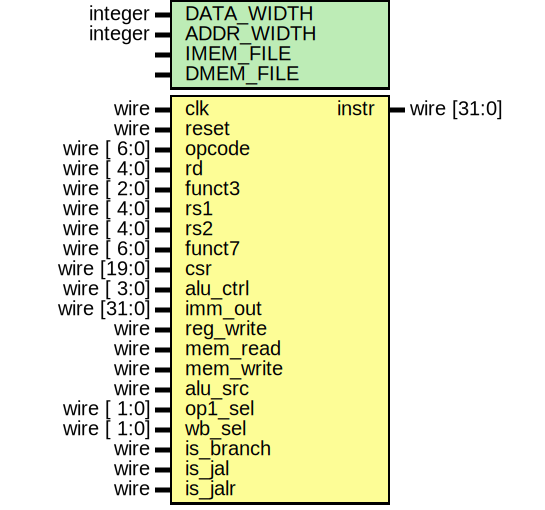


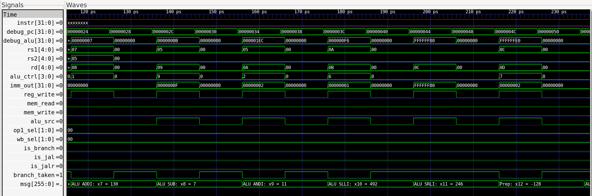
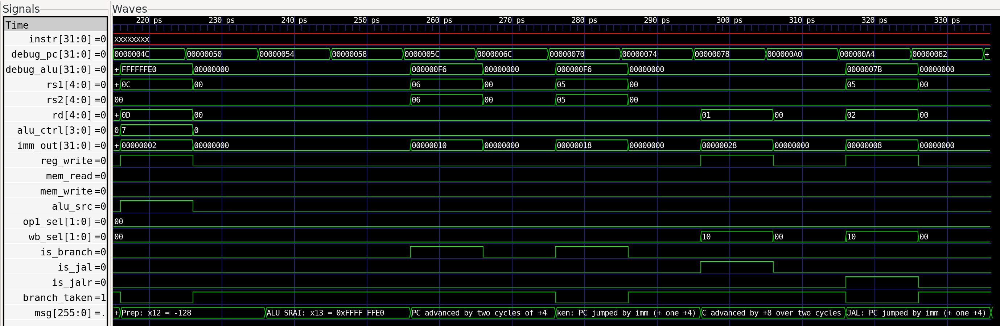

**Waveform explanation:** Three snapshots capture incremental tests. First, `rd=5` with `imm_out=123` and `ALUSrc=1` writes `x5=123`. Next, enabling `mem_write` with `rs2=x5` stores `123` to data memory address `0x10`. Finally, branch and jump cases show BEQ updating the PC by `imm+4`, BNE falling through, and JAL/JALR writing `rd` with `PC+4` while redirecting control flow. These traces confirm coordination among ALU, register file, memories, and PC logic.

### Glue Modules

#### decoder_glue
**Purpose.** Consolidates instruction classification, main control, and immediate generation.

**Outputs.**
- Controls for datapath: `reg_write`, `mem_read`, `mem_write`, `alu_src`, `op1_sel`, `wb_sel`, `alu_op`, `imm_sel`
- Flow flags: `is_jal`, `is_jalr`, `is_branch`
- Instruction class flags: `is_lui`, `is_auipc`, `is_alu_reg`, `is_alu_imm`, `is_load`, `is_store`, `is_system`
- Immediate value: `imm_out`

**Notes.** No `op2_sel`; main control provides `branch_sig`/`jump` internally, but the top-level uses only `is_*` flags.

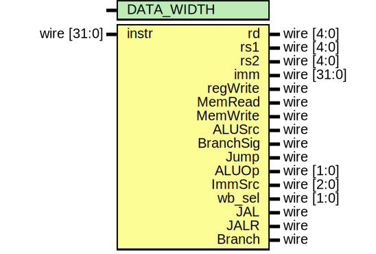

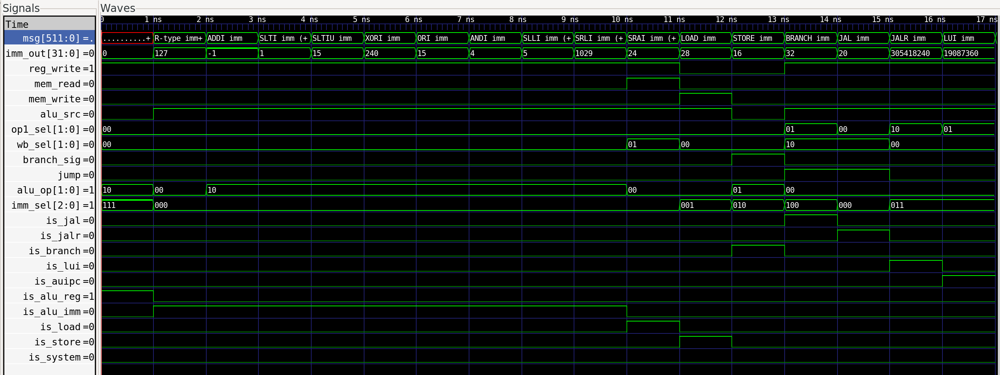

**Waveform explanation:** `decoder_glue` combines field slicing, immediate generation, and control decode. The testbench builds instructions with helper functions and checks outputs after a 1 ns settle. The waveform confirms correct extraction of `rd`, `rs1`, `rs2`, proper immediate sign extension, and aligned control signals such as `regWrite`, `ALUSrc`, `MemRead`, `MemWrite`, and `wb_sel`.

#### next_pc
**Purpose.** Determine `pc_next` from `pc_current`, `imm_out`, register values, and branch/jump decisions.

**Behavior.**
```verilog
pc_next =  is_jalr ? { (rs1 + imm)[31:1], 1'b0 } :
           is_jal  ? pc_current + imm :
           (is_branch && branch_taken) ? pc_current + imm :
                                        pc_current + 4;
```
Bit 0 is cleared for JALR targets. Commented simulation code exists for misalignment checks.


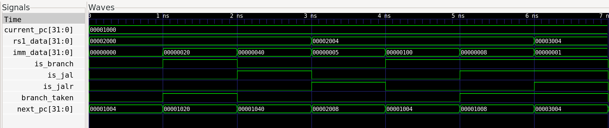

**Waveform explanation:** The combinational block selects `pc+4` by default, a branch target when `branch_taken` asserts, JAL targets with priority over branches, and JALR with alignment masking taking top priority. The waveform confirms each case and demonstrates that JAL overrides branch, while JALR overrides both.

### Leaf Modules

#### adder
Parameterizable combinational adder: `result = a + b`.


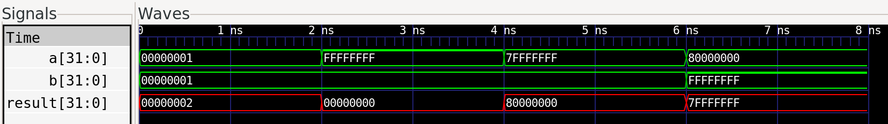

**Waveform explanation:** The waveform shows a purely combinational 32‑bit add. Each test bench vector asserts `a`, `b`, and waits 2 ns for `result` to settle before comparison. The trace confirms:
- `1 + 1 → 2`
- `0xFFFFFFFF + 1 → 0` (wraparound)
- `0x7FFFFFFF + 1 → 0x80000000` (overflow into sign bit)
- `0x80000000 + 0xFFFFFFFF → 0x7FFFFFFF` (two’s‑complement behavior)
Because the DUT has no state, the output changes immediately when inputs change; the waveform aligns exactly with these checks.

#### alu
Implements RV32I operations (ADD/SUB, shifts, logical ops, SLT/SLTU). Outputs `alu_zero` when the result is zero.


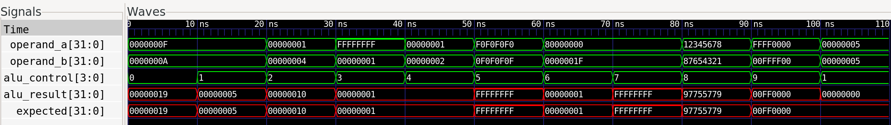

**Waveform explanation:** Stimuli sweep all RV32I ALU ops by driving operands, a 4‑bit control code, and sampling after 10 ns. Examples:
- `ctrl=0000` – addition: `15+10=25`
- `ctrl=0001` – subtraction: `15−10=5`
- Shift, compare, and boolean ops likewise match expected constants.
- A final subtraction of equal numbers asserts the `zero` flag.
Waveform transitions mirror these cases, verifying correct combinational behavior and flag generation.

#### alu_control
Converts `{alu_op, funct3, funct7[5]}` into a 4‑bit `alu_ctrl`, distinguishing shift directions and ADD vs SUB.


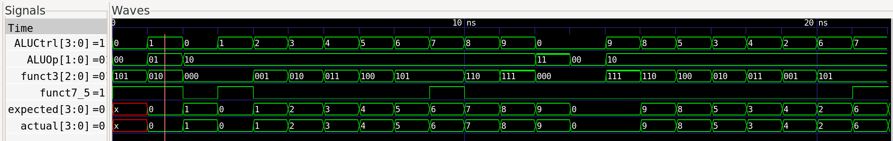

**Waveform explanation:** The test bench enumerates ALUOp/funct3/funct7 combinations and checks the 4‑bit control output one cycle later. The waveform steps through:
- Baseline cases (`ALUOp=00`→ADD, `ALUOp=01`→SUB).
- R‑type and I‑type mappings for every RV32I function (SLL, SLT, XOR, etc.).
- Immediate shift variants (SLLI/SRLI/SRAI) and logical immediates (ANDI/ORI/XORI).
The traces show `ALUCtrl` switching to the expected code for each stimulus, confirming the decoder’s truth table.

#### branch_comp
Evaluates BEQ/BNE/BLT/BGE/BLTU/BGEU using signed or unsigned comparisons as required.


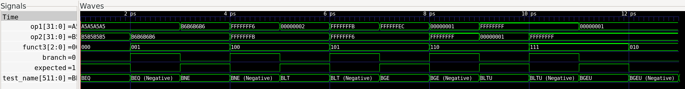

**Waveform explanation:** The branch comparator waveform looks inverted because each test assigns operands, waits `#1` time unit, and then checks the output. As soon as the check finishes, the next test overwrites `op1`, `op2`, and `funct3` without a delay. In the VCD, `branch` reflects the new inputs immediately while the `expected` variable still holds the previous value, making them appear opposite. The textual test results are still correct because the comparison happens after the intended delay. Inserting a register or extra delay before reassigning inputs would keep the waveform aligned with the logical check.

#### control
Sets default control lines, then overrides them based on instruction‑class flags:

- Outputs: `mem_read`, `mem_write`, `alu_src`, `branch_sig`, `jump`, `alu_op`, `imm_sel`, `wb_sel`, `op1_sel`
- Does not output `reg_write`; that comes from `decoder`.
- No `op2_sel` or `kill_wb` handling.

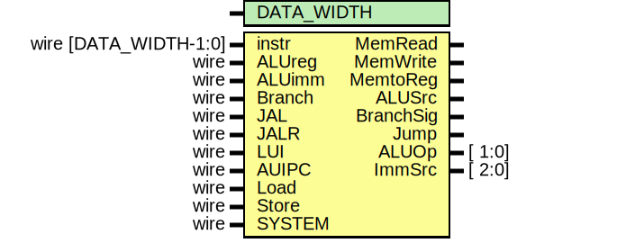

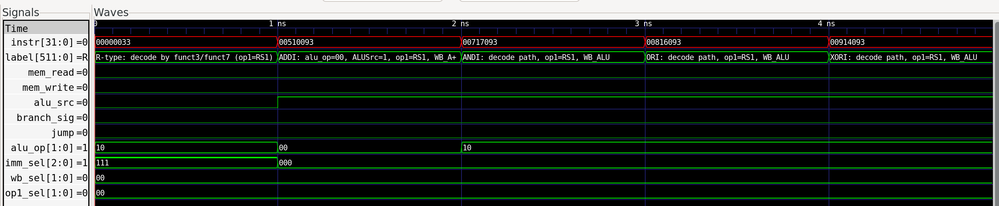
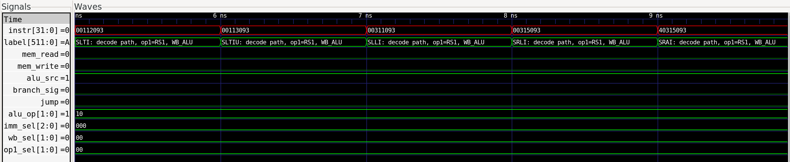
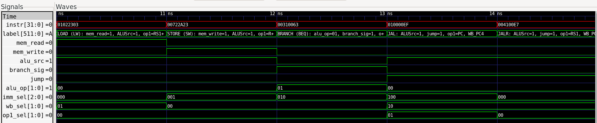
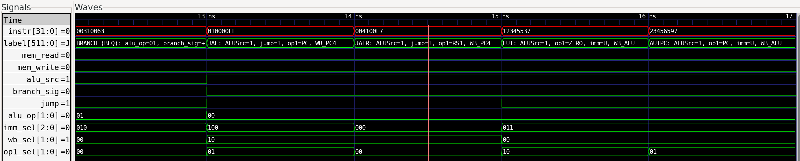

**Waveform explanation:** The control unit receives instruction bits plus one‑hot class flags and outputs memory, ALU, and write‑back controls. Test sequences encode each instruction type and verify the resulting signals via `expect_ctrl`. The segments show R‑type, I‑type, load/store, branch, and jump cases toggling `alu_op`, `ALUSrc`, memory enables, and `wb_sel` exactly as expected.

#### data_mem
Word‑wide synchronous write, combinational read RAM. Uses `$readmemh`. No byte strobes or load sign‑extension logic.


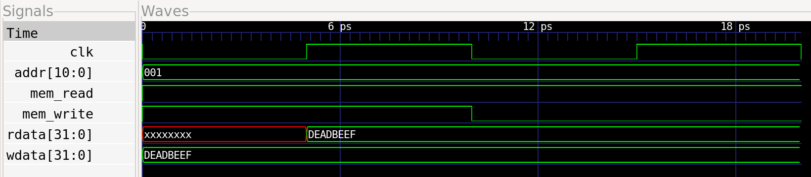

**Waveform explanation:** The combinational read is visible as `rdata` drives `0xDEADBEEF` in the same cycle that `addr=1` and `mem_read=1` assert. Because `mem_write` stays low, no write occurs even though `wdata` holds `0xDEADBEEF`. The output remains stable while the address and read enable are unchanged, confirming asynchronous read and synchronous write behavior.

#### decoder
Coarsely classifies the opcode into instruction types (`is_alu_reg`, `is_branch`, etc.) and sets the `reg_write` seed.

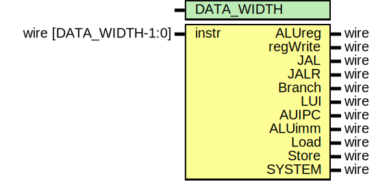

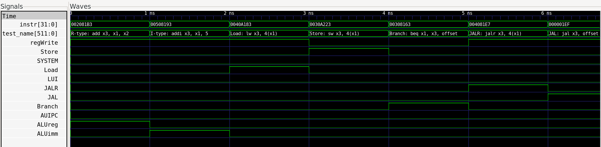
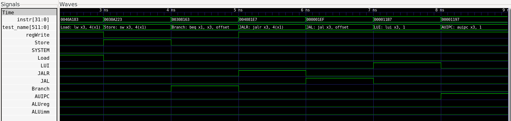

**Waveform explanation:** The decoder waveform shows one‑hot instruction class outputs reacting to opcode changes. The test bench applies R‑type, I‑type, load/store, branch, jump, and U‑type encodings and checks each flag after 1 ns. Each change in `instr` produces the expected class signals and `regWrite` flag.

#### imm_gen
Produces sign‑extended immediates for I/S/B/U/J formats via `imm_sel`.


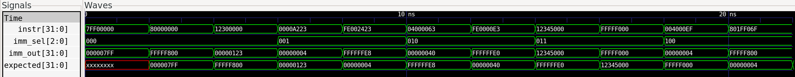

**Waveform explanation:** The testbench exercises all five RISC‑V formats. The waveform shows correct sign extension and shifting—for example, an I‑type yields `0x000007FF`, an S‑type negative offset becomes `0xFFFFFFE8`, a B‑type `0x04000063` turns into `0x00000040` after shifting, and U/J‑types pass upper/immediate fields unchanged.

#### instr_mem
Combinational ROM indexed by word address; initialized from a hex file.


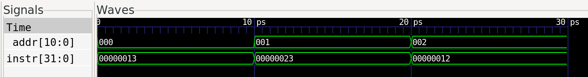

**Waveform explanation:** The instruction memory provides combinational reads. As `addr` steps through 0–2, `instr` updates immediately without a clock, matching the expected words and confirming asynchronous read behavior.

#### instr_slicer
Extracts instruction fields (`opcode`, `rd`, `funct3`, `rs1`, `rs2`, `funct7`, `shamt`, `csr`). Provided as a utility but not used in controller.

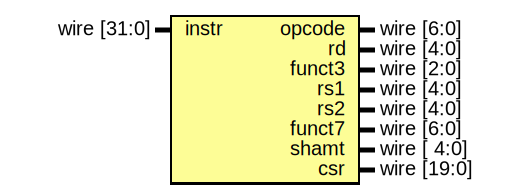

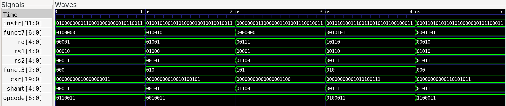

**Waveform explanation:** The slicer extracts opcode, register indices, funct3/7, shamt, and CSR fields directly from `instr`. For each pattern, the testbench asserts equality after 1 ns. The waveform verifies that every slice matches the source bits, covering CSR fields, edge patterns, and random instructions.

#### mux2 / mux4
Generic parameterized multiplexers for two or four inputs, respectively.

#### pc
Program counter register with asynchronous reset and synchronous update.


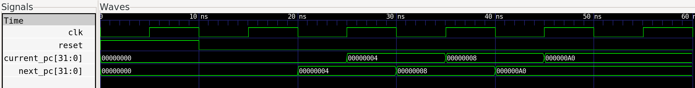

**Waveform explanation:** The PC register samples `next_pc` on rising clock edges and resets to zero. The waveform shows reset, sequential increments by 4, and a branch target load, all occurring synchronously on clock edges.

#### regfile
32×32‑bit register file. Asynchronous reads, synchronous writes, and x0 write blocking. No `kill_wb` port.


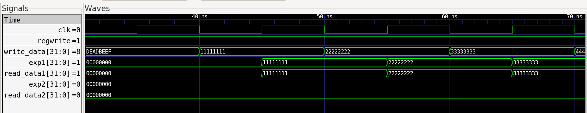

**Waveform explanation:** The register file has synchronous writes and asynchronous reads. The waveform highlights reset clearing all registers, writes occurring on clock edges, reads reflecting values immediately, and attempts to write x0 being ignored.

#### wb_mux
Selects between ALU result, memory data, or `pc_plus4` and gates writes to avoid x0 and to honor `kill_wb`. (Present as a standalone module but not instantiated in the current datapath.)


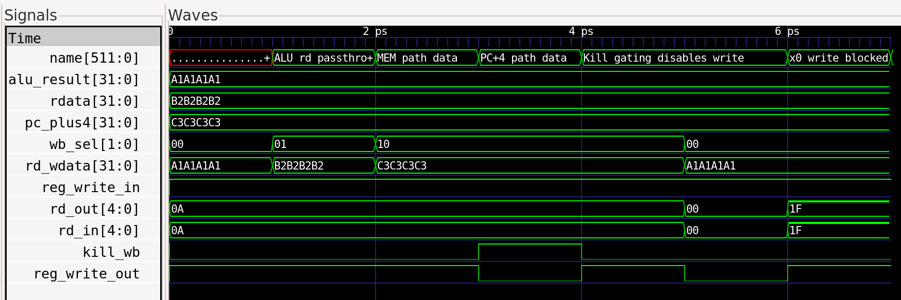

**Waveform explanation:** The write‑back multiplexer resolves register write requests, honoring kill gating and x0 suppression. When `kill_wb=1`, `reg_write_out` is forced low and `rd_out` goes to zero. If the destination is x0, writes are also suppressed. These combinational decisions ensure cancelled instructions and writes to x0 never update the register file.

## 22. References

1. *RISC‑V ISA Specification, Volume I*  
2. *Icarus Verilog* and *GTKWave* documentation  
3. *Xilinx Vivado Design Suite* user guides  
4. *Yosys* and *netlistsvg* documentation

