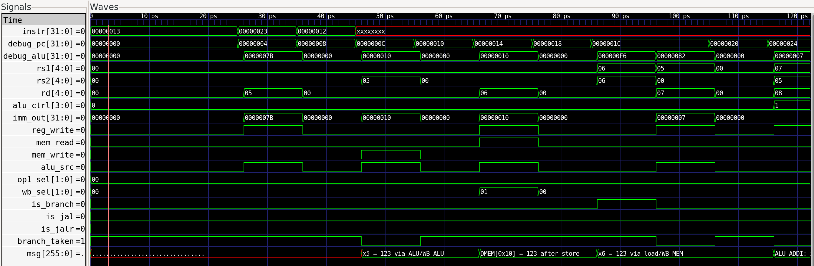

# RISC-V CPU Design and Simulation – Internship Report

## 1. Introduction  
This project implements a modular, single-cycle RISC-V CPU core written in Verilog. The repository includes reusable building blocks, control logic, a streamlined Makefile-driven flow, and testbenches for simulation.

> **Figure 1:** _Overall CPU Block Diagram_  
> 

## 2. Objectives  
- Develop a fully functional single-cycle CPU that executes a subset of the RISC-V ISA.  
- Provide self-contained Verilog modules for instruction decoding, control, execution, memory access, and write-back.  
- Automate linting, simulation, waveform generation, and schematic rendering using a unified `make` workflow that includes both Icarus Verilog and Vivado flows.

## 3. Tools & Environment  
- **Icarus Verilog** for compilation and simulation.  
- **GTKWave** for waveform inspection.  
- **Vivado XSIM** and schematic tools (`yosys`, `jq`, `netlistsvg`) integrated into the default Make targets—these are mandatory components of the build flow.  
- The Makefile workflow lints, builds, runs, and opens waveforms for all `tb/*_tb.v` testbenches, ensuring both Icarus and Vivado simulations are run by default.  
- Project layout separates headers, leaf RTL, glue logic, top wrappers, testbenches, and generated artifacts.

> **Figure 2:** _Vivado Flow Diagram_
> 

## 4. Methodology

- **Version Control**  
  Development tracked via GitHub with feature branches and frequent commits.

- **Coding Guidelines**  
  Verilog‑2001 syntax only, with consistent `snake_case` naming for modules and signals.

- **Automation**  
  Makefile targets run lint, simulation, schematics, and Vivado tasks in one flow.

- **File Structure**  
  Headers, leaf RTL, glue modules, testbenches, and generated outputs are kept in distinct directories.

## 5. Simulation & Debug Process

Typical workflow when issues surfaced:

1. **Recreate the failure** using `make` to run both Icarus and Vivado simulations.
2. **Inspect waveforms** in GTKWave or XSIM to compare expected vs. observed behavior.
3. **Iterate** from leaf modules to the integrated datapath and finally the full CPU.

Examples:
- Instruction memory failed to load in XSIM due to a relative-path mismatch.
- Undefined opcodes produced unexpected toggling on control signals.

Waveform snapshots (expected vs. observed) were annotated to document each fix.

## 6. Validation

- Programs tested: `add`, `store`, `load`, `jump`.
- Output cross‑checked with RARS or QEMU to confirm correctness.
- Coverage limited to the implemented RV32I subset.

## 7. Comparison & Benchmarking

Compared the design with PicoRV32:

- **Instruction coverage**: partial RV32I vs. PicoRV32’s broader set.
- **Resource usage**: higher LUT/FF count due to single-cycle simplicity.
- **Latency**: single cycle per instruction vs. PicoRV32’s multi-cycle approach.

## 8. Limitations

- Single-cycle architecture constrains maximum clock frequency.
- No CSR or system instruction support.
- Synthesis reports flag unconstrained clocks and many unconstrained endpoints.

## 9. Learning Outcomes

- Mastered Vivado TCL scripting and Makefile automation.
- Gained experience in modular RTL design and waveform‑based debugging.
- Developed a deeper understanding of datapath/control separation.

## 10. Reflection (Internship Specific)

- **Challenges**: integrating disparate toolchains, resolving simulation mismatches.
- **Skills gained**: FPGA flow familiarity, collaborative version control.
- **Future application**: solid foundation for FYP and potential FPGA/ASIC roles.

## 11. System Architecture

| Layer | Description | Citations |
|-------|-------------|-----------|
| **Top-Level CPU** | Integrates the controller and datapath, wiring instruction fields, control signals, and memory interfaces | |
| **Controller** | Extracts opcode, registers, immediates, and derives control signals via `decoder_glue` and `alu_control` | |
| **Datapath** | Coordinates instruction fetch, register file access, ALU operations, branch logic, memory access, and write-back selection | |
| **Next PC Unit** | Chooses sequential PC or branch/jump targets, aligning JALR addresses and verifying alignment | |
| **Leaf Modules** | ALU supports arithmetic, logical, and shift operations with zero detection; branch comparator evaluates conditional jumps | |
| **Figure 3:** _Controller–Datapath Interaction_  |
|  |

A complete inventory of modules and their interfaces is documented for quick reference.

## 12. Implementation Highlights
- Parameterizable data and address widths allow experimentation with different memory sizes.  
- Immediate generation, control, and execution paths remain decoupled for clarity and reuse.  
- Memory files (`src/instr_mem.mem`, `src/data_mem.mem`) enable preloaded programs and data.  

## 13. Testing & Verification
- Each module has an associated testbench (`tb/<module>_tb.v`), automatically discovered by the Makefile.  
- Running `make` performs lint, build, simulation, waveform dumping, **and Vivado simulation** for all testbenches.  
- Schematic rendering (`make schem`) visualizes module structure, aiding design reviews.

> **Figure 4:** _Waveform Example_  
> 

## 14. Challenges & Mitigations
- **Instruction-alignment checks** in `next_pc` identify misaligned addresses during simulation, preventing silent control-flow errors.  
- **Branch diversity** is handled by a dedicated comparator module, simplifying decoder logic and ensuring extensibility.

## 15. Results
The repository provides a complete, simulation-ready RISC-V core with comprehensive testbenches and an extensible build system. The modular design facilitates future enhancements, experimentation, and instructional use.

## 16. Future Work
- Introduce pipelining to improve throughput.  
- Add hazard detection and forwarding.  
- Expand instruction coverage (e.g., system instructions, multiplication/division).  
- Integrate a cache or memory hierarchy for realistic performance evaluation.

## 17. Conclusion
This project delivers a clean, modular foundation for RISC-V CPU exploration. The codebase’s structure, documentation, and automated tooling—now including mandatory Vivado flows—make it suitable for both educational purposes and further research or development.

## 18. Appendices

- **Instruction Subset Table**: list supported RV32I instructions.
- **Sample Testbench**: e.g., `alu_tb` with brief explanation.
- **Waveform Screenshots**: key modules and CPU integration.
- **Vivado Reports**: synthesis, utilization, timing summaries.
- **Repository Tree**: top-level project structure for quick orientation.

## 19. Vivado Reports
The `logs/` directory contains Vivado-generated synthesis, timing, power, and rule-check reports for the `cpu` design. Key highlights include:

- Clock reports show the top-level `clk` is unconstrained, leaving 2,080 endpoints without timing analysis.
- A design rule check warns about a missing PS7 block (`ZPS7-1`).
- Methodology analysis flags 1,000 non-clocked sequential cells and extensive use of distributed RAM.
- Power analysis estimates total on-chip power of 3.618 W with the program counter consuming the largest share.
- Timing summary lists thousands of unconstrained internal endpoints and undefined I/O delays.
- Utilization reports 2,439 slice LUTs and 1,056 slice registers in use.

These reports guide next steps such as adding clock constraints, resolving DRC warnings, and optimizing resource usage.

---

### Testing
No tests were executed in this read-only review environment.

### Notes
This report is based on static inspection; dynamic behavior and performance were not validated.

## 20. Appendix: Module Overview

### adder
Ripple-carry adder for summing operands.

### alu
Performs arithmetic and logic operations and sets a zero flag.

### alu_control
Decodes ALUOp and funct fields into a specific ALU control code.

### branch_comp
Compares operands and determines branch decisions.

### control
Top-level control logic driving datapath and memory sequencing.

### controller
Finite state machine orchestrating overall CPU execution.

### cpu
Top-level CPU wrapper combining controller and datapath modules.

### data_mem
Data memory providing load and store access.

### datapath
Wires registers, ALU, memories, and multiplexers together.

### decoder
Extracts instruction fields and produces basic control signals.

### decoder_glue
Auxiliary logic supporting decoder outputs.

### imm_gen
Generates immediate values from instruction fields.

### instr_mem
Instruction memory storage for program code.

### instr_slicer
Splits the instruction into its constituent fields.

### next_pc
Computes the next program counter value based on branch logic.

### pc
Program counter register holding the current instruction address.

### reg_file
Register file supporting two reads and one write each cycle.

### wb_mux
Selects the data source for register write-back.

## 21. References

1. *RISC‑V ISA Specification, Volume I*  
2. *Icarus Verilog* and *GTKWave* documentation  
3. *Xilinx Vivado Design Suite* user guides  
4. *Yosys* and *netlistsvg* documentation

